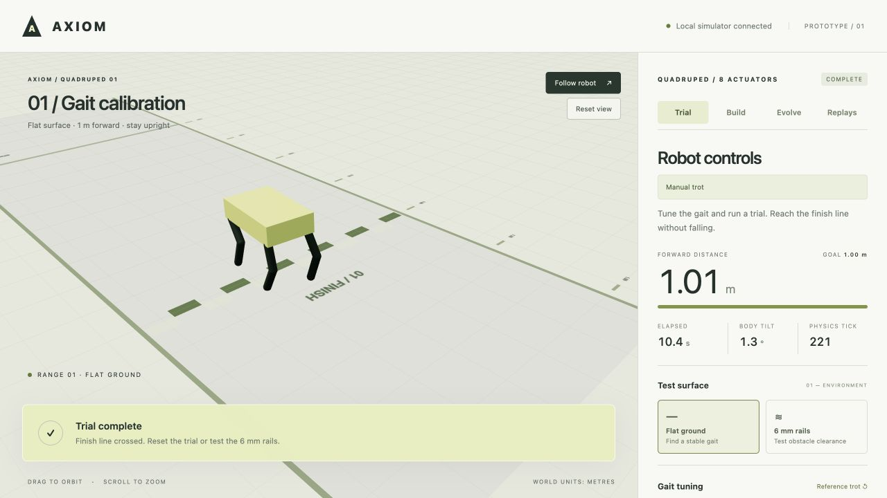
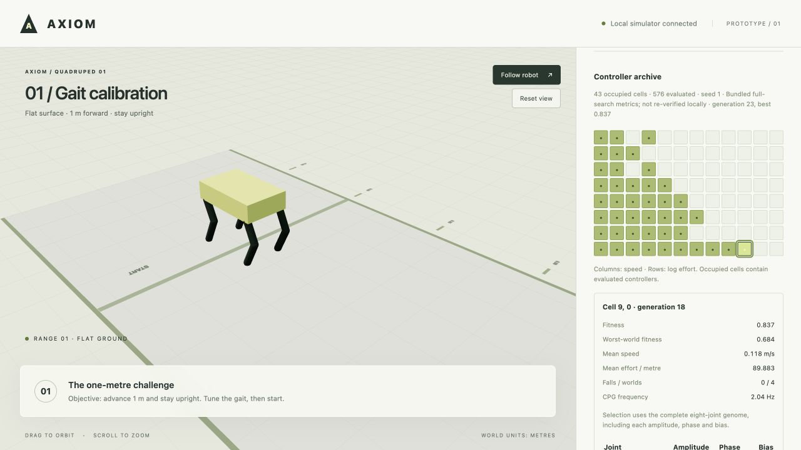

# Axiom workshop demo

Build a quadruped, run a physical simulation, inspect its recorded movement and
compare eight-joint movement controllers. In the current 3D mode, the user changes
the body and evolution searches for controllers; body dimensions do not evolve
automatically.

## Start the local workshop

Install Rust 1.89 or newer, then run from the repository root:

```sh
bin/axiom play
```

Open **http://127.0.0.1:8790/** in a browser with WebGL support. The first launch
compiles the Rust application. No account, API key or cloud service is required.
The equivalent command is `cargo run --release --locked -p axiom-field -- lab`.

## Three-minute workshop flow

1. In **Trial**, leave the reference trot and flat course selected. Click
   **Start trial**. Watch the robot move and the distance, tilt and simulation
   time change until the run finishes or falls. A successful trial reaches the
   one-metre finish line; the displayed measurements come from Rust physics.
2. Open **Replays** and select the completed recording. Scrub **Recorded frame**
   to inspect the saved collider poses. The recording does not advance the live
   simulation. Use **Download recording JSON** to retain it beyond the session,
   then **Return to live**.
3. Open **Evolve → Load bundled archive**. This restores the nominal robot and
   selects the best training controller from the earlier 576-candidate search.
   It returns to **Trial** so the loaded controller can be driven immediately.
4. Open **Evolve** again to inspect the 43 occupied archive cells. Select a cell,
   read its controller and score, then click **Use selected controller** and run
   another trial. Columns represent speed and rows represent log effort. The
   bundled scores are historical, not fresh measurements from this session.
5. Open **Build** to inspect physical design parameters and **Export workshop**.
   The save contains the design, gait, selected controller and archive. Applying
   a new design resets the trial, controller and archive, so export first if you
   want to retain the current workshop.





## Run a fresh search

In **Evolve**, choose an integer seed and 1–12 generations, then click
**Run evolution**. Each generation evaluates 12 candidates across three perturbed
flat-ground worlds. Progress and cancellation are available while the background
worker runs; an incomplete search does not replace the previous archive. Select
an occupied cell from the completed search and drive it in **Trial**.

**Test unseen worlds** re-evaluates the archive against three unseen flat-ground
parameter worlds. These are software holdouts. They do not validate the rails
course, hardware performance or transfer to a real robot, and a short search does
not guarantee an improved gait.

## What to explain while showing it

Rust and Rapier own joint motion, contacts, fixed simulation ticks, falling and
trial completion. The browser renders the actual collider transforms and exposes
the measurements and recordings. **Space** starts or pauses, **R** resets, drag
orbits the camera and scroll zooms; shortcuts leave focused form inputs alone.

This is a single-user local simulation prototype. It binds to loopback, keeps
workshop state in memory and has a 60-second trial limit. Export before stopping
the server. Workshop imports are capped at 256 KiB and validated before replacing
state; imported metrics are labelled and holdout results are recomputed. Robot
parameters are not calibrated against hardware.

## Workshop verification

```sh
cargo fmt --all -- --check
cargo clippy --workspace --all-targets -- -D warnings
cargo test --workspace --locked
npm ci
npm test
npm run lint
```

## Planar research workflow

The earlier planar morphology and neural-controller engine is a separate model.
The `/3d` research journal is not the current rigid-body workshop. Its Arm64
allocation measurements describe the root research engine, not the 3D game's
runtime speed or hardware behavior.

The historical challenge flow is preserved here:

1. Lead with [the Arm64 result card](docs/axiom-arm64-result.png): the optimized
   rollout uses 94.38% fewer allocation calls and requests 89.73% fewer bytes,
   with the complete evolution report unchanged.
2. Run `cargo run --locked -- gui`, open `http://127.0.0.1:8787/3d`, and identify
   the live morphology, CPG controller, rough-terrain task, fitness, archive
   coverage, and lineage.
3. Select Archive Lab cell 0,7 and contrast its 9-part, 0.86-stability elite
   with the champion in cell 6,5. Then compare generation 6 with generation 12.
4. Choose **Evolve next generation**. Show the replay, progress chart, Archive
   Lab, journal, and timeline updating from the Rust backend together.
5. Use [the core-loop map](docs/axiom-core-loop.png) to trace observation
   → brain → action → simulation → fitness → MAP-Elites.
6. Save a checkpoint, then run `axiom handoff CHECKPOINT --output shortlist.json`.
   Show the full genomes selected as champion, stable, explorer, and lean candidates—the bridge
   from an experiment archive to creature design in another runtime.
7. Open [docs/ARM64_OPTIMIZATION.md](docs/ARM64_OPTIMIZATION.md), connect the
   reusable buffers to the two measured allocation results, and show the full
   report SHA-256 correctness gate. State that runtime speedup is not claimed.
8. Close on the moving creature: allocator traffic fell without changing the
   experiment's result.

The exact shot sequence, captions, timed narration, and recording checklist are
in [docs/SUBMISSION_ASSETS.md](docs/SUBMISSION_ASSETS.md).

### Research verification

```sh
cargo fmt --all -- --check
cargo clippy --workspace --all-targets -- -D warnings
cargo test --workspace --locked
node --test web/tests/*.test.mjs
cargo run --release --locked --example arm64_optimization_benchmark -- --quick
cargo run --locked -- gui --check
cargo package --locked
```
