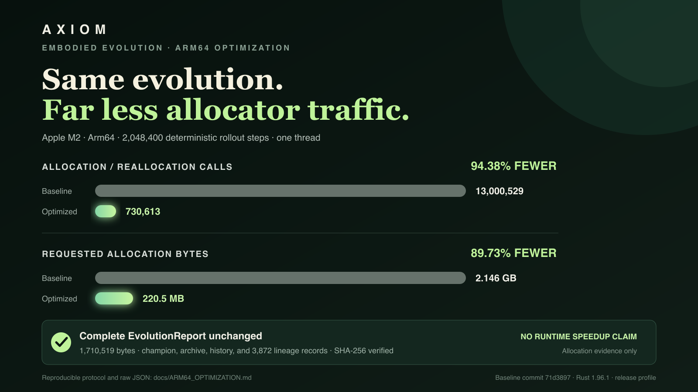
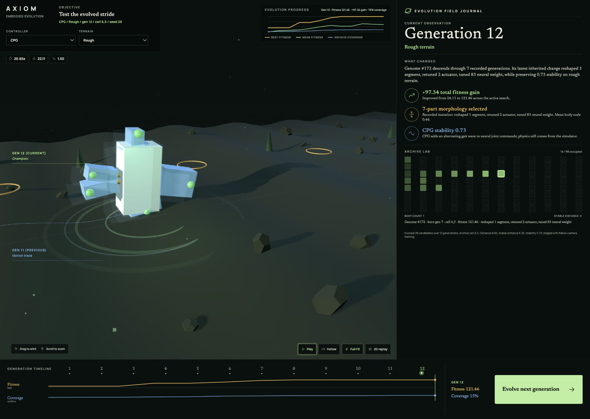

# Axiom

> A Rust quality-diversity sandbox for evolving bodies and neural controllers.

Axiom is a Rust embodied-evolution sandbox. It evolves simple body plans and neural controllers across terrain tasks, then keeps diverse elites in a MAP-Elites archive instead of collapsing everything to one winner.

Start with the reviewer-ready walkthrough in [DEMO.md](DEMO.md).

## Arm64 optimization

This work was built for the **Arm Create: AI Optimization Challenge**
(Track 1 — Physical AI), submitted August 2026. That challenge has since
closed; the optimization, the measurements, and the reproduction protocol
below are kept because they stand on their own.

The track fit the project as it already was: simulated sensor observations
drive neural-controller inference, actuator commands, embodied motion, fitness,
and MAP-Elites selection in one deterministic loop.

Axiom's deterministic rollout hot path now reuses observation, neural-network,
action, and snapshot buffers. On an Apple M2 Arm64 host, the full fixed-seed
workload used **94.38% fewer allocation/reallocation calls** and requested
**89.73% fewer allocation bytes**, while the complete evolution report remained
identical to the pre-optimization baseline. See the reproducible protocol, raw
JSON, source hashes, and limitations in
[docs/ARM64_OPTIMIZATION.md](docs/ARM64_OPTIMIZATION.md). The screenshot sequence and
recording plan prepared for the submission are in
[docs/SUBMISSION_ASSETS.md](docs/SUBMISSION_ASSETS.md).

Anyone on Arm64 can reproduce this with the copy-paste quick verification and
check the result against its expected semantic digest — written for the
challenge's judges, and still the fastest way to confirm the claim:
[Arm64 quick check](docs/ARM64_OPTIMIZATION.md#arm64-judge-quick-check).
Apple Silicon release usage and the source-build fallback are documented in
[docs/APPLE_SILICON.md](docs/APPLE_SILICON.md).





This rebuild is scoped from the previous Axiom review thread:

- morphology genomes with directional attachments
- compiled neural controllers with explicit bias handling
- feedforward, recurrent, and CPG controller modes
- stateful rollout semantics shared by evaluation and playback-style code
- deterministic simulation with replace-on-respawn behavior
- task fitness for flat and rough terrain
- MAP-Elites quality-diversity search
- regression tests for the correctness failures called out in review

## Quick Start

The [`bin/axiom`](bin/axiom) CLI wraps every command this repo runs. Put it on
your PATH once with `bin/axiom link` (symlinks into `~/.local/bin`), then:

```sh
axiom test
axiom demo
axiom gui
axiom animate cpg
axiom evaluate cpg
axiom evolve --generations 10 --population 32 --steps 180 --save checkpoints/run.json
axiom evolve --pack rough-inspection --report-json reports/inspection.json --report-md reports/inspection.md
axiom inspect checkpoints/run.json
axiom animate --checkpoint checkpoints/run.json --frames 160 --fps 20
axiom handoff checkpoints/run.json --output exports/candidate-shortlist.json
axiom bench
axiom bench arm64
axiom verify
```

`axiom help` lists everything, including `lint`, `coverage`, the site tasks,
and the allocation-counting benchmark variant. Simulation commands forward to
the Rust binary unchanged (`axiom gui` ≡ `cargo run --locked -- gui`; add `-r`
for a release build), and the development commands run the same invocations as
CI — the canonical `cargo` forms remain in [AGENTS.md](AGENTS.md). Installing
the crate itself (`cargo install --path .`) also yields an `axiom` binary with
the simulation commands.

`cargo run -- gui` binds `127.0.0.1:8787` and is unauthenticated by intent —
a single-user local tool. Do not expose it beyond the host; see
[SECURITY.md](SECURITY.md) for the trust boundary.

## Architecture

See the judge-readable system map and authority boundaries in
[docs/ARCHITECTURE.md](docs/ARCHITECTURE.md).

- `genome.rs` encodes body morphology and neural genomes.
- `network.rs` compiles neural genomes and keeps bias nodes separate from external inputs.
- `policy.rs` implements feedforward, recurrent, and CPG brain execution.
- `simulation.rs` owns the deterministic physics approximation and body attachment geometry.
- `fitness.rs` defines task rollout and the shared observation vector.
- `qd.rs` implements MAP-Elites archive insertion, replacement, and sampling.
- `evolution.rs` ties evaluation, archive maintenance, and parent selection together.
- `checkpoint.rs` saves complete, versioned experiment state with atomic replacement.
- `handoff.rs` turns archive diversity into a versioned, downstream-importable creature shortlist.

## Current Scope

The Rust core is complete and covered by regression tests, and a browser surface now sits on top of it: a 2D creature simulator at `/`, a 3D evolved-stride viewer at `/3d` (orbit camera, follow mode, terrain presets, and a selectable MAP-Elites Archive Lab; Three.js r165 is bundled for offline use), and a `/api/replay` endpoint that serves both minimal random genomes and `mode=evolved` replays evolved on demand. Evolved replays now carry the selected genome's real parent lineage and mutation record rather than inferring ancestry from generation aggregates.

## Reproducible Experiments

Save the full configuration, champion, archive, generation history, and lineage in a versioned checkpoint:

```sh
cargo run -- evolve --generations 16 --population 32 --steps 180 --seed 42 --save checkpoints/run-42.json
cargo run -- inspect checkpoints/run-42.json
cargo run -- animate --checkpoint checkpoints/run-42.json --frames 160 --fps 20
```

For a deterministic inspection across rough terrain, tilt recovery, and a step
field, pass `--pack rough-inspection`. `--report-json` and `--report-md` write
human- and machine-readable summaries without replacing the complete,
versioned checkpoint.

Checkpoint writes use a temporary sibling file and atomic replacement, so an interrupted save does not leave a partially written destination. Unknown checkpoint versions and malformed files fail with an explicit load error. Archive dimensions must be non-zero and match the serialized cell count exactly, so a truncated or internally inconsistent repertoire is refused before inspection, replay, or handoff.

Move from an experiment to downstream creature design with a deterministic shortlist:

```sh
cargo run -- handoff checkpoints/run-42.json --output exports/run-42-shortlist.json
```

The `axiom.candidate-shortlist.v1` document preserves each selected genome and evaluation while
assigning practical roles: champion, stable, explorer, and lean. One genome may fill several
roles. The handoff carries the checkpoint seed, archive context, selection policy, and explicit
software-only / no-hardware-validation limitations; it does not claim engine-specific import or
sim-to-real readiness.

To compare many runs at once — archive coverage, QD-score, and best fitness across seeds and generation budgets — export the checkpoints to Parquet and query them with DuckDB. The checkpoint format is unchanged; the export is a read-only columnar copy:

```sh
pip install -r requirements-duckdb.txt
python script/export_checkpoints_parquet.py
```

See [docs/duckdb.md](docs/duckdb.md) for the schema and a worked cross-seed comparison.

The `animate` command provides a terminal replay renderer over the same simulation loop:

```sh
cargo run -- animate cpg --task rough --frames 160 --fps 20
cargo run -- animate feedforward --task flat --frames 80 --fps 30
```

The `gui` command starts a local browser interface backed by Rust replay data:

```sh
cargo run -- gui
open http://127.0.0.1:8787
```

## License

MIT — see [LICENSE](LICENSE).
