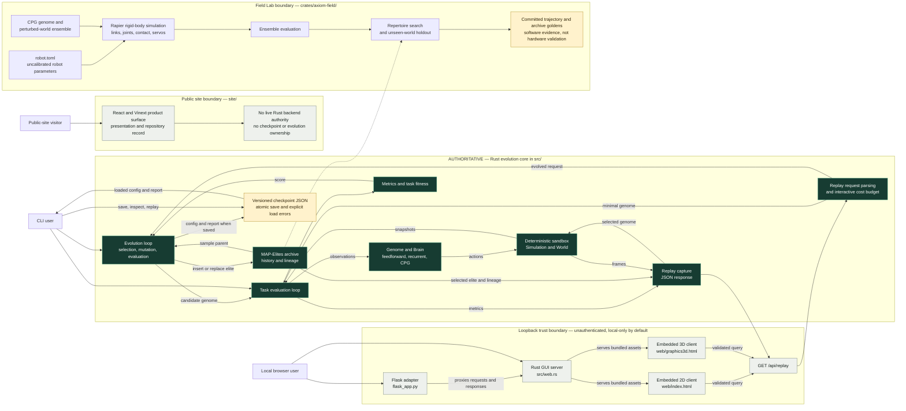

# Axiom architecture

> The Rust crates own simulation and experiment semantics; browser and Python surfaces expose or present those results without becoming a second source of truth.

The rendered submission asset is [axiom-architecture.png](axiom-architecture.png).
The large-type video/gallery version of the authoritative evolution path is
[axiom-core-loop.png](axiom-core-loop.png).

## System map

Solid arrows are runtime control or data flow. The single dashed arrow is a code dependency: Field Lab reuses the generic `axiom::qd::Grid` mechanics, but owns its CPG payload, descriptors, evaluation, and search report.

## Boundaries that matter

### Authority

- `src/` is authoritative for the root sandbox's genome execution, task evaluation, fitness, evolution, MAP-Elites archive, checkpoint format, and replay JSON.
- The embedded clients render and request Rust replay data. They do not independently score genomes or mutate the authoritative archive.
- `flask_app.py` is a loopback reverse proxy. It does not reimplement replay generation or evolution.
- `site/` is a separate public product surface. It may explain or demonstrate Axiom, but it is not connected to the Rust replay server and does not own full evaluation, evolution, or persistence semantics.
- `crates/axiom-field/` is authoritative only for its fixed-robot rigid-body experiments. It is deliberately separate from the root sandbox's abstract locomotion model.

### Trust

- The Rust GUI and Flask adapter are unauthenticated single-user tools. Their safe default is loopback; exposing either beyond the host requires an external authenticated TLS boundary.
- `/api/replay` is read-only, but evolved requests consume compute. Request parsing rejects workloads above the interactive budget before running them.
- The public site remains outside the local simulation boundary and must not acquire local credentials, checkpoint writes, or production mutation authority by implication.

### Determinism and evidence

- Root evolution is tested for identical results from a fixed seed, and complete versioned checkpoints preserve the configuration, report, archive, history, and lineage needed to inspect a run. The shared MAP-Elites deserializer rejects zero, overflowing, or cell-count-mismatched grid dimensions before either root checkpoints or Field Lab reports can expose inconsistent archive evidence.
- Field Lab asserts bit-identical trajectories for identical inputs within one binary. Across x86_64 and aarch64, its committed goldens assert behavioral bands because rigid-body contact amplifies floating-point differences.
- Field Lab's bundled robot parameters are uncalibrated. Perturbed-world holdouts and committed artifacts are reproducible software evidence, not measured sim-to-real transfer or hardware validation.

## Judge paths

1. **Inspect an evolution:** CLI → evolution loop → task evaluation → MAP-Elites archive → versioned checkpoint.
2. **Watch an elite:** embedded browser client → `/api/replay` → validated Rust evolution/evaluation → replay JSON → 2D or 3D rendering.
3. **Inspect the physical-model claim:** Field Lab configuration → rigid-body simulation → perturbed-world ensemble → repertoire and holdout artifacts, with the uncalibrated boundary kept explicit.
